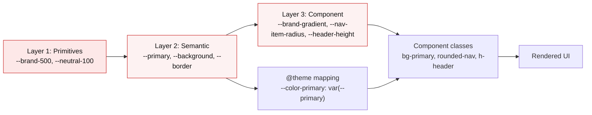
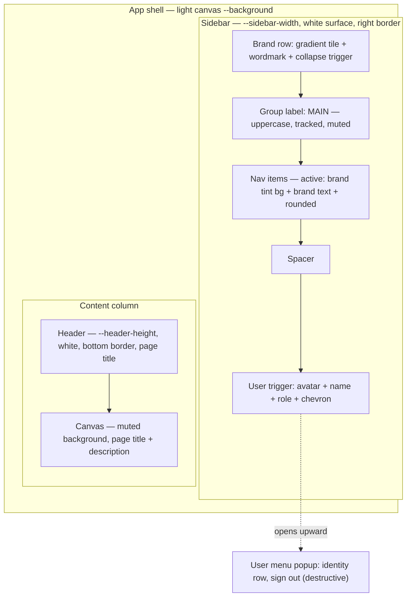

# refactor: Token-driven red-gradient UI theme

## Summary

Replace the stock Laravel React starter-kit look with a single-source-of-truth theme system matching `references/ss-theme.png`, swapping the reference's green accent for a red gradient. All color, radius, shadow, spacing, typography, and gradient values move into one file — `resources/css/globals.css` — organized in three layers (primitives → semantic → component tokens). Every page, layout, and component consumes those tokens instead of hardcoded Tailwind color literals, so a future retheme means editing one file and nothing else.

Dark mode is removed entirely: the `.dark` token block, the appearance hook, the appearance settings page and route, and every `dark:` utility in the retheme surface. The result is a light-only, red-accented boilerplate covering the app shell, dashboard, auth pages, and settings pages.

---

## Problem Frame

The app currently ships the unmodified Laravel React starter kit: neutral-gray shadcn defaults, a `Laravel Starter Kit` brand block, a breadcrumb header, and `Repository` / `Documentation` footer links pointing at Laravel's GitHub. Two problems block feature development:

1. **No visual identity.** The UI does not resemble the target design in `references/ss-theme.png`.
2. **Theme values are scattered.** Colors live in three places — the `:root` / `.dark` blocks in `resources/css/app.css`, the `@theme` mapping above them, and hardcoded literals sprinkled through components (`bg-neutral-200`, `text-green-600`, `stroke-neutral-900/20`, `dark:bg-neutral-700`, `#4B5563` in `resources/js/app.tsx`). Changing the accent color today means hunting through ~20 files.

The goal is a boilerplate solid enough that all subsequent work is feature work, never theme work.

---

## Requirements

| ID | Requirement |
|----|-------------|
| R1 | All theme values (color, radius, shadow, gradient, spacing, typography, layout dimensions) live in `resources/css/globals.css`. No color literal or spacing magic number in any `.tsx` file. |
| R2 | The app shell renders 1:1 with `references/ss-theme.png` — sidebar structure, brand tile, group label, nav item states, user footer trigger, user menu popup, header bar, content canvas — with the reference's green replaced by red. |
| R3 | The red accent is expressed as a gradient (matching the reference's gradient treatment on the brand tile and primary action), available as a reusable token and a button variant. |
| R4 | Dark mode is fully removed: no `.dark` token block, no appearance hook, no appearance settings page or route, no `dark:` utilities in the retheme surface. |
| R5 | Auth pages (login, register, forgot-password, reset-password, confirm-password, verify-email) and settings pages (profile, password) render on the new tokens. |
| R6 | Existing shadcn primitives remain shadcn-compatible in API shape, so future `npx shadcn add` components drop in without rewiring. |
| R7 | `npm run build`, `npm run lint`, and `php artisan test` all pass after the change. |

**Explicitly not required:** the reference's usage meter ("Researches 5 / 5", "Limit reached") and its header action button ("Scan Now"). Confirmed out of scope — see Scope Boundaries.

---

## Key Technical Decisions

### KTD1 — One theme file, three token layers

`resources/css/globals.css` becomes the single theme source, structured as:

- **Layer 1 — Primitives.** Raw ramps with no semantic meaning: `--brand-50` … `--brand-900`, `--neutral-50` … `--neutral-900`, plus raw gradient stops. Never referenced directly by components.
- **Layer 2 — Semantic.** What the app means, not what it looks like: `--background`, `--foreground`, `--surface`, `--primary`, `--muted-foreground`, `--border`, `--destructive`, `--sidebar-*`. Each points at a Layer 1 primitive.
- **Layer 3 — Component tokens.** Values specific to one piece of chrome: `--header-height`, `--sidebar-width`, `--nav-item-height`, `--nav-item-radius`, `--brand-gradient`, `--shadow-popover`, `--brand-tile-size`.

`resources/css/app.css` shrinks to a thin entry that imports Tailwind then `globals.css`, keeping `vite.config.js` and `resources/js/app.tsx` unchanged.

**Rationale:** the layer split is what makes retheming a one-file edit. Changing the brand hue means editing the `--brand-*` ramp only; every semantic and component token inherits. Without the split, a hue change touches dozens of semantic tokens individually.

**Tailwind v4 constraint:** the existing `@theme` block already uses the `--color-x: var(--x)` indirection pattern, which is how Tailwind v4 generates utilities from runtime-overridable custom properties. Preserve that pattern — do not inline literal values into `@theme`, or runtime override stops working.

### KTD2 — Brand red and destructive red must stay distinguishable

The reference uses green for brand and red for danger, so the two never collide. Swapping brand to red creates a collision: `Sign out`, input errors, and the delete-account button all currently use red.

**Resolution — separate by both shade and treatment:**

- **Brand red** (`--primary`): bright, gradient-capable. Applied as filled gradient (primary buttons, brand tile), light tint (active nav background), or accent text. Center around `hsl(0, 72%, 51%)`.
- **Destructive red** (`--destructive`): deeper, flatter brick. Around `hsl(0, 62%, 41%)`. Applied only as text or ghost treatment, never as a gradient fill.

The visual rule an implementer follows: **gradient or tint means brand; flat deep-red text means danger.** Encode this as a comment block in `globals.css` so the distinction survives future edits.

### KTD3 — Restyle shadcn primitives in place; add a thin composed layer on top

Do not fork a parallel component set. The shadcn primitives in `resources/js/components/ui/` already read CSS variables, so pointing them at the new tokens is mostly deleting hardcoded classes. Where the reference needs chrome shadcn has no primitive for (the brand tile, the page header, the user menu rows), add small composed components in `resources/js/components/` that build on the primitives.

**Rationale:** satisfies R6 — a future `npx shadcn add dialog` inherits the theme automatically because it reads the same variables. A forked component set would drift.

**Change budget inside `ui/`:** variant definitions, default classes, and token references only. Do not change component prop APIs, `forwardRef` shapes, or Radix wiring.

### KTD4 — Dark mode removal is a deletion, not a feature flag

Delete `resources/js/hooks/use-appearance.tsx`, `resources/js/components/appearance-tabs.tsx`, `resources/js/components/appearance-dropdown.tsx`, `resources/js/pages/settings/appearance.tsx`, the `settings/appearance` route, and the `Appearance` entry in the settings nav. Remove the `initializeTheme()` import and call in `resources/js/app.tsx`.

**Rationale:** a stubbed toggle that does nothing is worse than no toggle. No test references the appearance route (verified — `tests/` has no `appearance` references), so removal is clean. Reintroducing dark mode later means re-adding a `.dark` block against tokens that are already correctly layered — the Layer 1/2 split from KTD1 makes that straightforward.

### KTD5 — Header shows page title, not breadcrumbs

The reference header shows a single bold page-context line, not a breadcrumb trail. Replace `AppSidebarHeader`'s breadcrumb rendering with a title/subtitle-driven header. Keep `resources/js/components/breadcrumbs.tsx` and `resources/js/components/ui/breadcrumb.tsx` on disk unused rather than deleting them, so breadcrumbs can be reinstated for deep-nested pages later without re-adding the shadcn primitive.

The `breadcrumbs` prop currently threaded through `AppLayout` from every page is replaced by a `title` / `description` prop pair. This touches every page in scope — accounted for in U5.

---

## High-Level Technical Design

### Token resolution flow



A retheme edits Layer 1 only. Layers 2 and 3 propagate automatically. This is the property R1 is really asking for.

### Shell anatomy from the reference



Directional guidance for structure and naming, not implementation specification.

---

## Output Structure

New files only; existing files are modified in place.

```text
resources/
├── css/
│   ├── app.css          (modified — thin entry: import tailwind, import globals)
│   └── globals.css      (NEW — the entire theme: all three token layers + base + shared utilities)
└── js/
    └── components/
        ├── app-brand.tsx     (NEW — gradient tile + wordmark, replaces app-logo/app-logo-icon usage)
        └── page-header.tsx   (NEW — page title + description block for the content canvas)
```

Not a constraint — the implementer may adjust if a better layout emerges. Per-unit **Files** lists are authoritative.

---

## Implementation Units

### U1. Build the theme foundation in `globals.css`

**Goal:** Establish the single-source theme file with all three token layers and the red palette derived from the reference.

**Requirements:** R1, R3, R4 (partial — removes `.dark`)

**Dependencies:** none

**Files:**
- `resources/css/globals.css` (create)
- `resources/css/app.css` (modify — reduce to `@import 'tailwindcss'; @plugin 'tailwindcss-animate'; @source …; @import './globals.css';`)

**Approach:**

Extract the reference palette and swap the green family for red. Starting values (tune against the screenshot during U4/U5 verification):

| Token | Value | Reference role |
|-------|-------|----------------|
| `--background` | `hsl(220, 20%, 97%)` | content canvas, light gray |
| `--surface` / `--card` / `--sidebar` | `hsl(0, 0%, 100%)` | sidebar and header, pure white |
| `--foreground` | `hsl(222, 47%, 11%)` | body and heading text |
| `--muted-foreground` | `hsl(220, 9%, 46%)` | descriptions, inactive nav |
| `--group-label` | `hsl(220, 9%, 65%)` | the `MAIN` label |
| `--border` | `hsl(220, 13%, 91%)` | sidebar/header dividers |
| `--brand-500` / `--primary` | `hsl(0, 72%, 51%)` | brand red |
| `--brand-100` / `--primary-tint` | `hsl(0, 86%, 96%)` | active nav background |
| `--brand-700` | `hsl(0, 74%, 42%)` | gradient end stop |
| `--brand-gradient` | `linear-gradient(135deg, hsl(2, 80%, 56%), hsl(0, 74%, 42%))` | brand tile, primary action |
| `--destructive` | `hsl(0, 62%, 41%)` | sign out, input errors (KTD2) |
| `--avatar-bg` | `hsl(0, 86%, 94%)` | avatar fallback tint |
| `--radius` | `0.5rem` | base radius |
| `--sidebar-width` | `16rem` | matches existing `SIDEBAR_WIDTH` |
| `--header-height` | `3.5rem` | reference header bar |
| `--shadow-popover` | soft, low-spread | user menu card |

Delete the `.dark` block entirely. Remove the `@custom-variant dark` declaration. Keep the `@theme` indirection pattern and extend it with the new tokens so Tailwind generates matching utilities.

Add a header comment block documenting the three layers and the KTD2 brand-vs-destructive rule.

**Patterns to follow:** the existing `@theme { --color-x: var(--x) }` indirection in `resources/css/app.css` — preserve it exactly; the existing `@layer base` border-color compatibility shim — keep it.

**Test scenarios:** `Test expectation: none -- pure design-token definition, no behavioral change. Verified visually in U8.`

**Verification:** `npm run build` succeeds. Loading any page shows the light-gray canvas and white sidebar rather than the old neutral defaults, even before component work lands.

---

### U2. Remove dark mode end to end

**Goal:** Eliminate every dark-mode code path so the theme has exactly one state.

**Requirements:** R4

**Dependencies:** U1

**Files:**
- `resources/js/hooks/use-appearance.tsx` (delete)
- `resources/js/components/appearance-tabs.tsx` (delete)
- `resources/js/components/appearance-dropdown.tsx` (delete)
- `resources/js/pages/settings/appearance.tsx` (delete)
- `resources/js/app.tsx` (modify — drop the `initializeTheme` import and call; move the hardcoded `progress.color: '#4B5563'` to read the brand token)
- `routes/settings.php` (modify — remove the `settings/appearance` route)
- `resources/js/layouts/settings/layout.tsx` (modify — remove the `Appearance` nav entry)
- `resources/js/components/app-header.tsx` (modify — remove `dark:` utilities and the appearance dropdown if referenced)
- `resources/js/components/delete-user.tsx`, `input-error.tsx`, `nav-footer.tsx`, `text-link.tsx`, `user-info.tsx`, `app-logo.tsx`, `ui/alert.tsx` (modify — strip `dark:` utilities)
- `resources/js/layouts/auth/auth-card-layout.tsx`, `auth-simple-layout.tsx`, `auth-split-layout.tsx` (modify — strip `dark:` utilities)
- `resources/js/pages/dashboard.tsx` (modify — strip 8 `dark:` utilities; the page is rebuilt in U5, but clean it now so no `dark:` survives this unit)

**Approach:** delete the four appearance files first, then let TypeScript surface the broken imports and fix each. `resources/js/pages/welcome.tsx` carries 22 `dark:` utilities but is out of scope — leave it untouched; it will look stale until a follow-up pass.

**Execution note:** run `npm run lint` after the deletions to catch orphaned imports before touching styling.

**Test scenarios:**
- `php artisan test` still passes — no test references the `appearance` route (verified during planning), so the suite should be green without modification. If any test fails, it is a genuine regression, not an expected update.
- Navigating to `/settings/appearance` returns 404 rather than a server error.
- Navigating to `/settings/profile` and `/settings/password` still renders, and the settings nav shows exactly two entries.

**Verification:** `grep -r "dark:" resources/js` returns hits only in `pages/welcome.tsx`. `grep -r "use-appearance" resources/js` returns nothing. `npm run build` and `php artisan test` both pass.

---

### U3. Point shadcn primitives at the new tokens

**Goal:** Make every base primitive render from `globals.css` so composed components inherit the theme for free.

**Requirements:** R1, R3, R6

**Dependencies:** U1, U2

**Files:**
- `resources/js/components/ui/button.tsx` (modify — add a `gradient` variant using `--brand-gradient`; retune `default`, `outline`, `ghost`, `destructive`; align sizes and radius to tokens)
- `resources/js/components/ui/input.tsx` (modify — border, radius, focus ring from tokens)
- `resources/js/components/ui/card.tsx` (modify — surface, border, radius, shadow from tokens)
- `resources/js/components/ui/dropdown-menu.tsx` (modify — popover surface, `--shadow-popover`, item hover and destructive item treatment)
- `resources/js/components/ui/avatar.tsx` (modify — fallback uses `--avatar-bg`, replacing the hardcoded `bg-neutral-200`)
- `resources/js/components/ui/separator.tsx`, `label.tsx`, `checkbox.tsx`, `alert.tsx` (modify — token colors)
- `resources/js/components/ui/sidebar.tsx` (modify — swap the hardcoded `SIDEBAR_WIDTH` / `SIDEBAR_WIDTH_ICON` constants to read the `--sidebar-width` tokens; retune `SidebarMenuButton` active/inactive states to the reference's brand-tint treatment)
- `resources/js/components/ui/placeholder-pattern.tsx` (modify — stroke color from tokens)

**Approach:** per KTD3, change variant strings and default classes only. `SidebarMenuButton`'s `isActive` state is the highest-value edit — the reference's active nav item is a brand-tint background with brand-colored text and icon at the token radius, versus the starter kit's gray `bg-sidebar-accent`.

The `gradient` button variant is added for R3 even though no in-scope surface instantiates it (the reference's `Scan Now` action is out of scope). It exists so the gradient treatment is defined once and available when the first real primary action lands.

**Patterns to follow:** the existing `cva` variant structure in `resources/js/components/ui/button.tsx` — extend the `variants.variant` map rather than restructuring it.

**Test scenarios:** `Test expectation: none -- presentation-only variant and class changes, no behavioral or API change. Confirm via U8 that no prop signature changed by checking that all existing call sites typecheck unmodified.`

**Verification:** `npx tsc --noEmit` passes with zero changes to any component that *consumes* these primitives — proof that APIs held. Buttons, inputs, and cards visibly pick up red accents and the new radius.

---

### U4. Rebuild the sidebar to match the reference

**Goal:** Sidebar renders 1:1 with the reference — brand row, group label, nav items, user trigger, user menu popup.

**Requirements:** R2, R3

**Dependencies:** U3

**Files:**
- `resources/js/components/app-brand.tsx` (create — gradient tile with initials plus wordmark; token-driven, no color literals)
- `resources/js/components/app-sidebar.tsx` (modify — use `AppBrand`; remove the `Repository` / `Documentation` footer nav pointing at Laravel's GitHub; set nav items to the app's own routes)
- `resources/js/components/nav-main.tsx` (modify — group label reads `MAIN` in the reference's uppercase/tracked/muted treatment, replacing `Platform`)
- `resources/js/components/nav-footer.tsx` (delete, or keep and stop rendering it — the reference has no footer nav)
- `resources/js/components/nav-user.tsx` (modify — trigger row shows avatar, name, role, and chevron per the reference)
- `resources/js/components/user-menu-content.tsx` (modify — popup shows the identity row and a destructive-treated `Sign out`; keep `Settings`)
- `resources/js/components/user-info.tsx` (modify — role line under the name; avatar fallback on `--avatar-bg`)
- `resources/js/components/app-logo.tsx`, `app-logo-icon.tsx` (modify or delete — the Laravel mark and `Laravel Starter Kit` wordmark are replaced by `AppBrand`)

**Approach:** the brand tile is a rounded square filled with `--brand-gradient` carrying two-letter initials in white — the reference's `ML` tile. Parameterize initials and wordmark as props so renaming the product is a one-line change.

The user menu in the reference opens **upward** from a bottom-anchored trigger. `NavUser` already passes `side={...}` to `DropdownMenuContent`; confirm the expanded-desktop case resolves to a top-opening placement.

**Test scenarios:**
- Sidebar renders the brand tile, the `MAIN` group label, and the nav items with no console errors.
- Clicking a nav item navigates and the destination item takes the active brand-tint treatment while the previous item reverts.
- Clicking the user trigger opens the menu above the trigger, not below, on desktop at expanded width.
- `Sign out` posts to the logout route and redirects — behavior unchanged from the starter kit.
- Collapsing the sidebar via the trigger (and via `Cmd/Ctrl+B`) still collapses to icon width without layout break, and the state persists across a reload.
- On a mobile viewport, the sidebar opens as a sheet and closes on navigation.

**Verification:** side-by-side against `references/ss-theme.png`, the sidebar matches in structure, spacing, and state treatment, with red where the reference has green.

---

### U5. Rebuild the header and content canvas

**Goal:** Header shows the page title per the reference; the content canvas uses the muted background and the page title/description block.

**Requirements:** R2, KTD5

**Dependencies:** U4

**Files:**
- `resources/js/components/page-header.tsx` (create — page title plus optional description, for the canvas)
- `resources/js/components/app-sidebar-header.tsx` (modify — replace breadcrumbs with the title line and the collapse trigger; height from `--header-height`)
- `resources/js/layouts/app-layout.tsx`, `resources/js/layouts/app/app-sidebar-layout.tsx`, `resources/js/layouts/app/app-header-layout.tsx` (modify — thread `title` / `description` in place of `breadcrumbs`)
- `resources/js/components/app-content.tsx` (modify — canvas background and padding from tokens)
- `resources/js/pages/dashboard.tsx` (modify — drop the `PlaceholderPattern` grid; render the title and description like the reference's `Dashboard` / `Your workspace overview will live here.`)
- `resources/js/types/index.ts` (modify — if `BreadcrumbItem` threading is part of a shared layout prop type)

**Approach:** KTD5 replaces the `breadcrumbs` prop with `title` / `description` across every page that renders `AppLayout`. Do this as one mechanical sweep — TypeScript will list every call site once the layout prop type changes.

Keep `breadcrumbs.tsx` and `ui/breadcrumb.tsx` on disk unused per KTD5.

**Test scenarios:**
- Dashboard renders with the header title line and the canvas title/description, matching the reference's two-level title treatment.
- Every page previously passing `breadcrumbs` compiles and renders — no page left passing a prop the layout no longer accepts.
- Collapsing the sidebar reflows the header and canvas without horizontal overflow.
- At a narrow viewport the header title truncates rather than wrapping or pushing the collapse trigger off-screen.

**Verification:** `npx tsc --noEmit` passes — proof no page still passes `breadcrumbs`. Dashboard matches the reference's content area.

---

### U6. Retheme the auth surfaces

**Goal:** Login, register, forgot-password, reset-password, confirm-password, and verify-email render on the new tokens.

**Requirements:** R1, R5

**Dependencies:** U3

**Files:**
- `resources/js/layouts/auth/auth-simple-layout.tsx` (modify — use `AppBrand`; remove the hardcoded `text-[var(--foreground)] dark:text-white`)
- `resources/js/layouts/auth/auth-card-layout.tsx`, `auth-split-layout.tsx` (modify — token surfaces and borders)
- `resources/js/pages/auth/login.tsx` (modify — the status message's hardcoded `text-green-600` becomes a token; this is the only green literal left in the tree)
- `resources/js/pages/auth/register.tsx`, `forgot-password.tsx`, `reset-password.tsx`, `confirm-password.tsx`, `verify-email.tsx` (modify — remove any remaining color literals)
- `resources/js/components/text-link.tsx`, `input-error.tsx` (modify — link color from brand token, error color from `--destructive`)

**Approach:** the reference does not show an auth screen, so match its *system* — white card on light canvas, brand-red primary action, token radius and spacing — rather than inventing a new layout. Keep the existing auth layout structure.

The `text-green-600` status message in `resources/js/pages/auth/login.tsx` needs a success token. Add `--success` to Layer 2 in `globals.css` (a green distinct from both reds) rather than reusing brand red, which would read as an error on a success message.

**Test scenarios:**
- Login submits with valid credentials and redirects to the dashboard — `tests/Feature/Auth/AuthenticationTest.php` covers this and must stay green.
- Submitting login with an invalid password renders the field error in destructive red below the field.
- The password-reset status message renders in the success color, visually distinct from an error message.
- Register, forgot-password, reset-password, confirm-password, and verify-email each render without console errors and with the brand-red primary button.
- Tab order through the login form is unchanged — the existing `tabIndex` values must survive the restyle.

**Verification:** `php artisan test --filter=Auth` passes. All six auth pages render on the new palette with no color literal remaining in the auth tree.

---

### U7. Retheme the settings surfaces

**Goal:** Profile and password settings render on the new tokens, with the appearance entry gone.

**Requirements:** R1, R5

**Dependencies:** U3, U5

**Files:**
- `resources/js/layouts/settings/layout.tsx` (modify — the nav's active state uses the brand-tint treatment from U3 rather than `bg-muted`; confirm the `Appearance` entry removed in U2 is gone)
- `resources/js/pages/settings/profile.tsx`, `resources/js/pages/settings/password.tsx` (modify — token surfaces, remove color literals, thread the new `title` / `description` layout props from U5)
- `resources/js/components/delete-user.tsx` (modify — destructive treatment per KTD2: deep flat red, not a gradient fill)
- `resources/js/components/heading.tsx`, `heading-small.tsx` (modify — typography from tokens)

**Approach:** `resources/js/layouts/settings/layout.tsx` reads `window.location.pathname` directly for the active state, which breaks under SSR (`resources/js/ssr.jsx` renders server-side). Switch to Inertia's `usePage().url`, matching the pattern already used in `resources/js/components/nav-main.tsx`. This is an SSR-correctness fix riding along with the retheme — flag it in the commit rather than burying it.

**Test scenarios:**
- Profile update submits and persists — `tests/Feature/Settings/ProfileUpdateTest.php` must stay green.
- Password update submits and persists — `tests/Feature/Settings/PasswordUpdateTest.php` must stay green.
- The settings nav shows exactly `Profile` and `Password`, and the entry matching the current URL carries the brand-tint active treatment.
- The delete-account button renders in flat destructive red (never gradient), and its confirmation dialog opens and cancels cleanly.
- With SSR enabled (`npm run build:ssr`), the settings page renders server-side without a `window is not defined` error.

**Verification:** `php artisan test --filter=Settings` passes. `npm run build:ssr` completes without error.

---

### U8. Full-tree audit and fidelity pass

**Goal:** Confirm R1 holds tree-wide and the shell matches the reference.

**Requirements:** R1, R2, R7

**Dependencies:** U1–U7

**Files:** no new files; corrective edits across the retheme surface as the audit surfaces them.

**Approach:** three sweeps.

1. **Literal sweep.** Grep the retheme surface for Tailwind color literals (`bg-neutral-`, `text-gray-`, `border-slate-`, `text-green-`, `stroke-neutral-`), hex codes, and `dark:`. Every hit outside `resources/js/pages/welcome.tsx` is an R1 violation to fix.
2. **Retheme proof.** Change the `--brand-500` primitive in `globals.css` to an obviously different hue (blue), reload, and confirm every brand surface — tile, active nav, primary button, focus ring, avatar tint — shifts together with no red left behind. Revert. This is the sharpest test that R1 actually holds; a stray literal shows up immediately.
3. **Fidelity pass.** Compare the running app against `references/ss-theme.png` at the same viewport width, checking sidebar width, header height, nav item height and radius, group-label treatment, brand tile size and radius, popup shadow and radius, and canvas background.

**Test scenarios:**
- The literal sweep returns zero hits outside `resources/js/pages/welcome.tsx`.
- The hue-swap proof shifts every brand surface with one token edit and leaves no red artifact.
- `npm run build`, `npm run build:ssr`, `npm run lint`, and `php artisan test` all pass.
- The dashboard at 1440px wide matches the reference's structure and spacing within a few pixels on each measured dimension.

**Verification:** all four commands green, the hue-swap proof clean, and the fidelity comparison documented.

---

## Scope Boundaries

### In scope
App shell (sidebar, header, canvas), dashboard, all six auth pages, profile and password settings, all shadcn primitives in `resources/js/components/ui/`, the theme file, and dark-mode removal.

### Out of scope
- **The reference's usage meter and header action.** The `Researches 5 / 5` meter and the `Scan Now` gradient action are not built. Confirmed during scoping.
- **`resources/js/pages/welcome.tsx`.** The marketing landing page keeps its 22 `dark:` utilities and starter-kit look. It will look visually stale until a follow-up pass — this is a known, accepted gap.
- **Backend, routes, models, and domain logic.** The only backend edit is removing the `settings/appearance` route in `routes/settings.php`.

### Deferred to follow-up work
- Retheming `resources/js/pages/welcome.tsx`.
- A reusable usage/quota meter, once a real quota concept exists.
- A primary header action slot, once a real primary action exists (the `gradient` button variant from U3 is already in place for it).
- Reintroducing dark mode against the Layer 1/2 token split, if it is ever wanted.

---

## Risks & Dependencies

| Risk | Impact | Mitigation |
|------|--------|------------|
| Brand red and destructive red read as the same color in practice, making `Sign out` look like a primary action | Medium | KTD2's dual separation — shade *and* treatment. Verify specifically in U4 and U7, not just in aggregate at U8. |
| Editing `ui/sidebar.tsx` breaks collapse, mobile sheet, or the keyboard shortcut | Medium | KTD3's change budget confines edits to classes and variants. U4's test scenarios exercise collapse, persistence, keyboard shortcut, and mobile explicitly. |
| The KTD5 breadcrumb-to-title migration misses a page, leaving a runtime prop mismatch | Low | TypeScript catches it — U5's verification is `tsc --noEmit` passing, which cannot pass with a stale call site. |
| Tokens defined in `@theme` with literal values instead of the `var()` indirection silently break runtime override | Medium | Called out in KTD1. U8's hue-swap proof detects it immediately — a broken indirection means the hue swap does not propagate. |
| Color values eyeballed from a PNG drift from the reference | Low | U8's fidelity pass compares side by side at a fixed viewport; U1's table is explicitly a starting point to tune, not a final answer. |
| `resources/js/pages/welcome.tsx` looks broken against the new theme since it is excluded | Low | Accepted and documented. Its `dark:` utilities are inert once the `dark` variant is removed, so it degrades to its light appearance rather than breaking. |

**Dependencies:** none external. Tailwind v4, shadcn, and Radix are already installed at the required versions. No new packages.

---

## Open Questions

Deferred to implementation — none blocks starting U1.

- **Product name and initials for the brand tile.** The reference shows `MarketLens` / `ML`. `AppBrand` takes both as props (U4), so this is a one-line change whenever it is decided. Until then, use the value in `config('app.name')`.
- **Exact gradient angle and stops.** U1 specifies `135deg` with two stops as a starting point. The reference's gradient is subtle; the final values come from the U8 fidelity comparison.
- **Whether the nav item active state carries a border or ring** in addition to the tint background. The reference is ambiguous at the available resolution. Decide by eye during U4.
- **Whether `nav-footer.tsx` and `app-logo*.tsx` are deleted or kept unused.** U4 allows either. Deleting is cleaner; keeping costs nothing. Implementer's call.

---

## Sources & Research

- `references/ss-theme.png` — the target design. Green accent, white surfaces, light-gray canvas; red here replaces green throughout.
- Local codebase scan — Laravel 12 + Inertia 2 + React 19 + Tailwind v4 (CSS-first, no `tailwind.config.js`) + shadcn (`neutral` base, `cssVariables: true`) + `lucide-react`.
- `resources/css/app.css` — the existing `@theme` indirection pattern that KTD1 preserves.
- `tests/` — verified no test references the `appearance` route, making KTD4's removal clean.

No external research was run: the codebase already demonstrates the token pattern this plan extends, and Tailwind v4 CSS-first theming with shadcn is a settled approach here.
