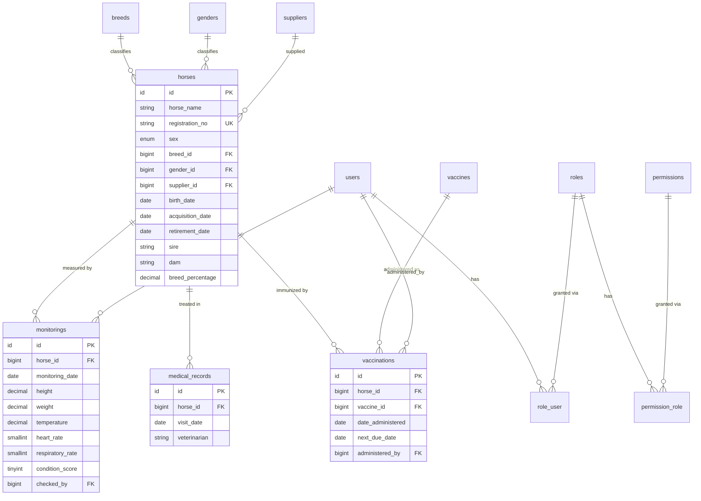
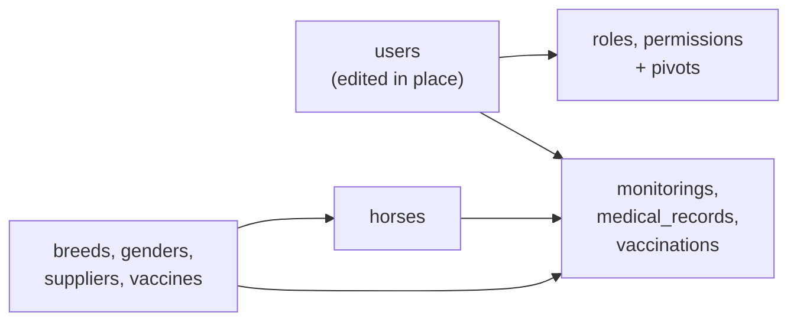

# feat: ERD-derived schema, migrations, and Eloquent models

## Summary

Build the persistence layer for the stud farm application from `references/erd-diagram.png`: migrations for every domain table, an Eloquent model per table with relationships wired in both directions, factories for all models, and a seeder that populates lookups plus sample horses. The completion signal is a clean `php artisan migrate:fresh --seed` against the configured MySQL database.

The ERD is treated as the authoritative source of *entities and fields*, not of *types and keys*. Four categories of diagram artifact are corrected to Laravel and SQL convention, each recorded as a decision below so the divergence is visible rather than silent.

No controllers, routes, form requests, policies, or UI. This unit of work ends at the model layer.

---

## Problem Frame

The application currently has no domain schema. `database/migrations/` holds only the three Laravel starter migrations (`users`/`password_reset_tokens`/`sessions`, `cache`, `jobs`), and `app/Models/` holds only `User`. Every feature that follows — horse records, health monitoring, vaccination scheduling, role-based access — depends on this layer existing first.

The ERD supplies 13 domain tables but was drawn as a diagram rather than generated from a schema, and carries the artifacts that implies:

- **Lookup tables float unconnected.** `breeds`, `genders`, and `suppliers` are drawn with no relationship lines to `horses`, while `horses` stores `supplier`, `gender`, and `sex` as free text and `breed` as a bare untyped integer.
- **Types are approximate.** `vaccines.expiry_date` is VARCHAR, `condition_score` is BIT, `two_factor` is BIT.
- **One key breaks convention.** `vaccinations` uses `vaccination_id` rather than `id`.
- **Actor columns are strings.** `monitorings.checked_by` and `vaccinations.administered_by` are VARCHAR where they denote a person acting in the system.

Building the schema literally would produce a database with no referential integrity, dates that cannot be compared, and a body-condition score that can only hold 0 or 1.

---

## Requirements

| ID | Requirement |
|----|-------------|
| R1 | Every domain entity in the ERD has a migration and an Eloquent model. |
| R2 | `horses` references `breeds`, `genders`, and `suppliers` through constrained foreign keys rather than free text. |
| R3 | Types and primary keys follow Laravel and SQL convention; each divergence from the ERD is documented. |
| R4 | Relationships are declared on both sides — every `belongsTo` has its matching `hasMany` or `belongsToMany`. |
| R5 | Roles and permissions are hand-rolled per the ERD (`roles`, `permissions`, `role_user`, `permission_role`), with no external authorization package. |
| R6 | Delete behavior is explicit on every foreign key — no column relies on the database default. |
| R7 | Every model has a factory producing valid, realistic data. |
| R8 | A seeder populates the lookup tables and creates sample horses with monitoring, medical, and vaccination records. |
| R9 | `php artisan migrate:fresh --seed` completes without error and leaves a queryable database. |

---

## Key Technical Decisions

### KTD1 — Lookups become foreign keys; `sex` becomes an enum

`horses` gains `breed_id`, `gender_id`, and `supplier_id` as nullable constrained foreign keys. The ERD's `supplier`, `gender`, and `breed` columns are dropped.

`sex` stays on `horses` as an enum of `male` / `female` rather than becoming a foreign key. It is biological, closed, and never needs administration — a lookup table for two immutable values is overhead with no payoff.

This resolves an ambiguity in the ERD, which carries both `sex` and `gender` on `horses` plus a separate `genders` table. Read together they describe two different facts: **sex** is the biological binary, **gender** is the equine life-stage-and-status term (stallion, mare, gelding, colt, filly). Both are kept, with `gender` normalized into the lookup table the ERD already provides.

**Rationale:** the ERD's floating lookup tables cannot be reached from any query as drawn. Foreign keys give referential integrity, make `Horse::with('breed')` possible, and let the lookups be managed as data rather than as typo-prone strings.

### KTD2 — ERD type and key corrections

| ERD | Becomes | Why |
|-----|---------|-----|
| `vaccinations.vaccination_id` (PK) | `id` | Laravel convention; avoids a `$primaryKey` override on one model out of eleven. |
| `vaccines.expiry_date` VARCHAR | `date` nullable | A string expiry cannot be compared, sorted, or filtered — the only operations this column exists for. |
| `monitorings.condition_score` BIT | `unsignedTinyInteger` nullable | Equine body condition is the Henneke 1–9 scale. BIT holds 0 or 1. |
| `users.two_factor` BIT | `boolean` default `false` | Genuinely boolean; `boolean` is the portable spelling. |
| `monitorings.checked_by` VARCHAR | nullable FK → `users` | Denotes the staff member who recorded the reading. |
| `vaccinations.administered_by` VARCHAR | nullable FK → `users` | Same reasoning as `checked_by`. |
| `medical_records.veterinarian` VARCHAR | stays `string` nullable | **Deliberate asymmetry.** A treating vet is typically an external practitioner with no account. Forcing an FK here would require creating user rows for people who never log in. |

### KTD3 — Hand-rolled roles and permissions

`roles`, `permissions`, `role_user`, and `permission_role` are built exactly as the ERD draws them, with `belongsToMany` on both sides. No `spatie/laravel-permission`.

**Rationale:** the package's schema (guard names, polymorphic model pivots) diverges from the ERD, so adopting it would mean the diagram no longer describes the database. The ERD's shape is simple enough that hand-rolling costs little.

**Consequence to accept:** permission checks are uncached and will issue queries per check. Acceptable at this stage; revisit if authorization moves onto a hot path.

### KTD4 — The `users` migration is edited in place

The two-factor columns and `deleted_at` are added by editing `database/migrations/0001_01_01_000000_create_users_table.php` rather than by adding an `ALTER` migration.

**Rationale:** the application has no production data and this plan runs `migrate:fresh` regardless, so an alter migration would add a permanent file recording a change that never actually happened to any real database. Editing in place keeps the migration history honest about what the schema *is*.

**This choice does not survive first deploy.** Once the schema exists anywhere real, all further changes must be additive alter migrations.

### KTD5 — Delete behavior is explicit everywhere

| Parent deleted | Child | Behavior | Why |
|----------------|-------|----------|-----|
| `horses` | `monitorings`, `medical_records`, `vaccinations` | cascade | These records have no meaning without their horse. |
| `vaccines` | `vaccinations` | restrict | Vaccination history is a medical record; removing a vaccine from the catalog must not erase the fact that it was administered. |
| `breeds`, `genders`, `suppliers` | `horses` | null | A horse outlives its supplier's record. Losing the label must not lose the horse. |
| `users` | `monitorings.checked_by`, `vaccinations.administered_by` | null | Staff turnover must not delete health history. |
| `users`, `roles` | `role_user`, `permission_role` | cascade | Pivot rows are meaningless without both sides. |

`restrict` on vaccines is the one that will surface in practice — deleting a used vaccine will throw. That is the intended behavior; soft-deleting or deactivating the vaccine is the correct alternative.

---

## High-Level Technical Design

### Corrected schema

`horses` is the hub: three lookups feed into it, three record tables hang off it, and `users` attaches to two of those record tables as the acting staff member.

### Migration ordering

Foreign keys require their target table to exist first, which fixes the sequence:

Lookups and the authorization block are independent of each other; both must precede `horses`, and `horses` must precede the three record tables.

---

## Implementation Units

### U1. Extend the users table and model

**Goal:** Bring `users` up to the ERD's shape — two-factor columns and soft deletes.

**Requirements:** R1, R3

**Dependencies:** none

**Files:**
- `database/migrations/0001_01_01_000000_create_users_table.php` (modify)
- `app/Models/User.php` (modify)

**Approach:**

Add to the `users` table: `two_factor` boolean default `false`, `two_factor_code` string nullable, `two_factor_expires_at` timestamp nullable, and `deleted_at` via `softDeletes()`. Leave `password_reset_tokens` and `sessions` untouched — the ERD's `password_resets` is the older name for the table Laravel already creates.

On the model, add the `SoftDeletes` trait, extend `$fillable` and `$hidden` (`two_factor_code` must be hidden), and cast `two_factor` to boolean and `two_factor_expires_at` to datetime.

Relationships are added in later units as their target tables come into existence — U2 for roles, U5 for the record tables.

**Patterns to follow:** the existing `casts()` method in `app/Models/User.php` — it uses the Laravel 11+ method form, not the `$casts` property.

**Verification:** `php artisan migrate:fresh` succeeds; `Schema::hasColumn('users', 'two_factor_code')` is true; existing auth tests in `tests/Feature/Auth/` still pass, since the columns are additive and nullable.

---

### U2. Authorization schema — roles, permissions, and pivots

**Goal:** The hand-rolled role and permission structure with both-sided relationships.

**Requirements:** R1, R4, R5, R6

**Dependencies:** U1

**Files:**
- `database/migrations/*_create_roles_table.php` (create)
- `database/migrations/*_create_permissions_table.php` (create)
- `database/migrations/*_create_role_user_table.php` (create)
- `database/migrations/*_create_permission_role_table.php` (create)
- `app/Models/Role.php` (create)
- `app/Models/Permission.php` (create)
- `app/Models/User.php` (modify — add `roles()`)

**Approach:**

`roles` and `permissions` each carry `id`, `title` (unique), timestamps, and `deleted_at`. The pivots carry only their two foreign keys, both cascading, with a composite primary key rather than an auto-increment `id` — a pivot row is identified by its pair.

Pivot tables get no timestamps; the ERD does not show them and nothing needs to know when a role was assigned. Add them later if an audit requirement appears.

Relationships: `User belongsToMany Role`, `Role belongsToMany User`, `Role belongsToMany Permission`, `Permission belongsToMany Role`. Both pivot table names are non-alphabetical by Laravel's convention (`role_user` is alphabetical, `permission_role` is too) so no explicit table name argument is needed — but state it explicitly anyway for readability.

Add convenience methods on `User` for checking a role by title and a permission by title, the latter resolving through the loaded roles. Keep them simple; they are not a policy layer.

**Verification:** in `php artisan tinker`, a user assigned a role that holds a permission returns true from the permission check; detaching the role makes it return false. Deleting a role removes its pivot rows and leaves the user intact.

---

### U3. Lookup tables — suppliers, breeds, genders, vaccines

**Goal:** The four reference tables `horses` and `vaccinations` will point at.

**Requirements:** R1, R3

**Dependencies:** none (independent of U1 and U2)

**Files:**
- `database/migrations/*_create_suppliers_table.php` (create)
- `database/migrations/*_create_breeds_table.php` (create)
- `database/migrations/*_create_genders_table.php` (create)
- `database/migrations/*_create_vaccines_table.php` (create)
- `app/Models/Supplier.php` (create)
- `app/Models/Breed.php` (create)
- `app/Models/Gender.php` (create)
- `app/Models/Vaccine.php` (create)

**Approach:**

- `suppliers` — `supplier_name`, `address` (text, nullable), `contact` nullable, `status` enum `active`/`inactive` defaulting to `active`.
- `breeds` — `name` unique, `description` text nullable.
- `genders` — `name` unique.
- `vaccines` — `name`, `manufacturer` nullable, `dose` nullable, `expiry_date` **date** nullable (KTD2).

Unique constraints on `breeds.name` and `genders.name` are what make these tables worth having; without them the lookup can hold "Thoroughbred" twice.

`hasMany` relations pointing back at `horses` and `vaccinations` are declared in U4 and U5, once those tables exist.

**Verification:** all four tables migrate; inserting a duplicate breed name fails on the unique constraint; `expiry_date` accepts a date and rejects a non-date string.

---

### U4. The horses table and model

**Goal:** The central entity, with lookups normalized into foreign keys.

**Requirements:** R1, R2, R3, R4, R6

**Dependencies:** U3

**Files:**
- `database/migrations/*_create_horses_table.php` (create)
- `app/Models/Horse.php` (create)
- `app/Models/Breed.php` (modify — add `horses()`)
- `app/Models/Gender.php` (modify — add `horses()`)
- `app/Models/Supplier.php` (modify — add `horses()`)

**Approach:**

Columns, following the ERD with KTD1 applied:

`horse_name`, `registration_no` (unique, nullable — not every horse is registered), `birth_date`, `sex` enum `male`/`female`, `gender_id` / `breed_id` / `supplier_id` (nullable FKs, `nullOnDelete`), `color`, `acquisition_date`, `retirement_date`, `description` (text), `sire`, `dam`, `parent_info` (text), `breed_percentage` `decimal(5,2)`, `horse_image`, timestamps.

`registration_no` must be `unique` **and** `nullable` — MySQL permits multiple NULLs in a unique index, which is exactly the desired behavior for unregistered horses.

`sire` and `dam` stay as strings per the ERD. Making them self-referencing foreign keys is the better long-term model for a stud farm but is deliberately not done here — see Open Questions.

Index `breed_id`, `gender_id`, and `supplier_id` (the FK constraint creates these) and add an index on `horse_name`, which will carry the search path.

**Patterns to follow:** the `foreignId(...)->constrained()->nullOnDelete()` form, so the FK name is generated consistently rather than hand-written.

**Verification:** creating a horse with a valid `breed_id` succeeds; an invalid `breed_id` is rejected by the constraint; deleting a breed sets its horses' `breed_id` to null rather than deleting the horses; `Horse::with(['breed', 'gender', 'supplier'])->first()` returns hydrated relations.

---

### U5. Horse record tables — monitorings, medical records, vaccinations

**Goal:** The three tables hanging off `horses`, with actor columns resolved to users.

**Requirements:** R1, R3, R4, R6

**Dependencies:** U1, U3, U4

**Files:**
- `database/migrations/*_create_monitorings_table.php` (create)
- `database/migrations/*_create_medical_records_table.php` (create)
- `database/migrations/*_create_vaccinations_table.php` (create)
- `app/Models/Monitoring.php` (create)
- `app/Models/MedicalRecord.php` (create)
- `app/Models/Vaccination.php` (create)
- `app/Models/Horse.php` (modify — add the three `hasMany`)
- `app/Models/Vaccine.php` (modify — add `vaccinations()`)
- `app/Models/User.php` (modify — add `monitoringsChecked()`, `vaccinationsAdministered()`)

**Approach:**

- **`monitorings`** — `horse_id` (cascade), `monitoring_date`, `height` `decimal(5,2)`, `weight` `decimal(6,2)`, `temperature` `decimal(4,1)`, `heart_rate` and `respiratory_rate` as `unsignedSmallInteger`, `condition_score` `unsignedTinyInteger` (KTD2), `notes` text, `checked_by` nullable FK → `users` (`nullOnDelete`).
- **`medical_records`** — `horse_id` (cascade), `visit_date`, `diagnosis` text, `treatment` text, `veterinarian` string (KTD2 — stays a string), `notes` text.
- **`vaccinations`** — `id` PK (KTD2), `horse_id` (cascade), `vaccine_id` (**restrict**, per KTD5), `date_administered`, `next_due_date` nullable, `administered_by` nullable FK → `users`, `dosage`, `notes`.

Index `monitorings.monitoring_date`, `medical_records.visit_date`, and `vaccinations.next_due_date` — all three are date-range query paths, and `next_due_date` in particular will drive any "due for vaccination" listing.

Cast all date columns on the models so they return `Carbon` instances rather than strings.

On `Horse`, add an accessor or scope for the most recent monitoring — it is the reading every horse detail view will want first. Keep it a single relation-based helper, not a query builder chain duplicated across the codebase.

**Verification:** deleting a horse removes its monitorings, medical records, and vaccinations; deleting a vaccine that has vaccinations throws a constraint violation; deleting a user nulls `checked_by` and leaves the monitoring row; `Monitoring::first()->monitoring_date` returns a Carbon instance.

---

### U6. Factories for every model

**Goal:** Realistic generated data for each model, so the schema is exercisable.

**Requirements:** R7

**Dependencies:** U2, U3, U4, U5

**Files:**
- `database/factories/HorseFactory.php`, `MonitoringFactory.php`, `MedicalRecordFactory.php`, `VaccinationFactory.php`, `VaccineFactory.php`, `SupplierFactory.php`, `BreedFactory.php`, `GenderFactory.php`, `RoleFactory.php`, `PermissionFactory.php` (create)
- `database/factories/UserFactory.php` (modify — cover the new two-factor columns)

**Approach:**

Values must be plausible, not merely non-null — a monitoring factory producing a 500 kg foal or a heart rate of 4000 makes the seeded data useless for eyeballing the UI. Use realistic ranges: adult weight 400–600 kg, height 14–17 hands, temperature 37.2–38.3 °C, heart rate 28–44 bpm, respiratory rate 8–16, condition score 4–6.

Relation columns use factory callbacks (`Breed::factory()`) so a factory can stand alone, but the seeder in U7 will pass explicit IDs to avoid creating a new breed per horse.

Add a `retired` state to `HorseFactory` that sets `retirement_date`, and an `expired` state to `VaccineFactory` that backdates `expiry_date` — both are conditions the UI will need to render.

**Verification:** `Horse::factory()->count(10)->create()` succeeds and produces horses whose FKs resolve; `Monitoring::factory()->create()` produces values inside the ranges above.

---

### U7. Seeder and full schema rebuild

**Goal:** A populated, queryable database from a single command.

**Requirements:** R8, R9

**Dependencies:** U6

**Files:**
- `database/seeders/DatabaseSeeder.php` (modify)
- `database/seeders/LookupSeeder.php` (create)
- `database/seeders/HorseSeeder.php` (create)
- `database/seeders/RolePermissionSeeder.php` (create)

**Approach:**

Lookups are seeded from **fixed lists, not factories** — a stud farm has real breeds (Thoroughbred, Arabian, Quarter Horse, Warmblood, Standardbred) and real genders (Stallion, Mare, Gelding, Colt, Filly). Random strings here would make the app look broken.

Roles and permissions likewise: seed a small real set (`Admin`, `Manager`, `Staff`; permissions covering horse, monitoring, medical, and vaccination management) rather than faker output.

Horses are seeded with factories, each getting a few monitorings across different dates, one or two medical records, and vaccinations drawn from the seeded vaccine list. Vary the dates so any chart or timeline has something to show, and leave a few horses sparsely populated so empty states are reachable.

`DatabaseSeeder` calls the three seeders in dependency order and keeps the existing test user creation.

**Execution note:** `php artisan migrate:fresh` **drops every table in the `horse-app` database and destroys all data in it.** At the time of writing that database holds only starter-kit scaffolding, so the cost is nil — but confirm the target database in `.env` before running, and never run this against an environment that has real records.

**Verification:** `php artisan migrate:fresh --seed` completes without error. Afterward: every lookup table has its fixed rows; horses exist with resolvable `breed`, `gender`, and `supplier`; at least one horse has monitorings, medical records, and vaccinations; the admin user has a role carrying permissions. Re-running the command is idempotent in effect — it rebuilds from empty every time.

---

## Scope Boundaries

### In scope
Migrations, models, relationships, factories, seeders, and a verified `migrate:fresh --seed`.

### Out of scope
- **Controllers, routes, form requests, policies, and API resources.** This plan ends at the model layer.
- **UI.** No Inertia pages or components. The front end built in the previous plan is untouched.
- **Sanctum and `personal_access_tokens`.** The ERD includes the table, but the package is not installed and there is no API surface to justify it yet. Confirmed out of scope during scoping.
- **Authorization enforcement.** U2 builds the role and permission *data*; nothing consumes it. Gates, policies, and middleware come later.

### Deferred to follow-up work
- **Schema and relationship tests.** Declined for this pass. Worth adding before the model layer grows: a test per relationship asserting it resolves, plus cascade-behavior tests for the `restrict` on vaccines and the `nullOnDelete` paths — those are the rules most likely to be broken silently by a later migration.
- **Self-referencing pedigree.** See Open Questions.
- **Soft deletes on `horses`.** The ERD puts `deleted_at` only on `users`, `roles`, and `permissions`. See Open Questions.
- **Permission check caching.** Accepted consequence of KTD3; revisit if authorization lands on a hot path.

---

## Risks & Dependencies

| Risk | Impact | Mitigation |
|------|--------|------------|
| `migrate:fresh` is run against a database that has real data | High | Called out explicitly in U7's execution note. Confirm `DB_DATABASE` before running. |
| The `restrict` FK on `vaccines` surfaces as an unhandled exception when a user deletes a used vaccine | Medium | Intended behavior, but it will throw at the UI layer with no friendly message. Note it for whoever builds vaccine management — the correct product answer is deactivation, not deletion. |
| Editing the users migration in place diverges from any database already migrated | Medium | Confined to KTD4's stated precondition: no real data exists yet. The decision explicitly does not survive first deploy. |
| Dropping `horses.supplier`/`gender`/`breed` loses the ERD's literal shape, so diagram and database no longer match | Low | Intended per KTD1 and confirmed during scoping. Worth regenerating the ERD from the built schema afterward so the reference stops drifting. |
| MySQL `enum` for `sex` is awkward to extend later | Low | Genuinely closed set. If it ever needs a third value, an alter migration handles it. |
| Seeded data looks plausible but is not domain-accurate | Low | Ranges in U6 are drawn from normal adult equine vitals; a domain expert should sanity-check before the data is used for anything but development. |

**Dependencies:** none new. Laravel 12 and the MySQL connection (`horse-app`) are already configured in `.env`. No Composer packages are added.

---

## Open Questions

Deferred to implementation or to a later decision — none blocks starting U1.

- **Should `sire` and `dam` become self-referencing foreign keys?** The ERD has them as strings, and this plan follows that. But pedigree is the core of a stud farm, and strings cannot express "this horse's sire is also in our system." The likely end state is nullable `sire_id`/`dam_id` FKs to `horses` *alongside* the text fields for ancestors not in the system. Held back because it is a modeling decision worth making deliberately rather than as a side effect of this pass.
- **Should `horses` carry soft deletes?** The ERD says no, and this plan follows. But a hard-deleted horse takes its entire medical and vaccination history with it via the cascade. That is a real data-loss path worth reconsidering before the app has users.
- **Does `suppliers.status` need more than active/inactive?** Modeled as a two-value enum from the ERD's untyped `status`. If procurement has more states, this is cheap to widen now and awkward later.
- **What is the intended precision of `breed_percentage`?** Modeled as `decimal(5,2)`, allowing 0.00–999.99. If it is strictly a 0–100 percentage, a check constraint or validation rule should enforce that.

---

## Sources & Research

- `references/erd-diagram.png` — the source diagram. Authoritative for entities and fields; corrected for types and keys per KTD2.
- Local codebase scan — Laravel 12, PHP 8.2, MySQL (`horse-app`), Inertia 2. `database/migrations/` holds only the three starter migrations; `app/Models/` holds only `User`. No Sanctum, no authorization package.
- `app/Models/User.php` — the `casts()` method form that new models should mirror.
- `tests/Feature/Auth/` and `tests/Feature/Settings/` — 27 existing tests that must stay green through U1's `users` change.

No external research was run: Laravel migration and Eloquent relationship conventions are settled, and the corrections in KTD2 follow from the ERD's own contents rather than from any external source.
